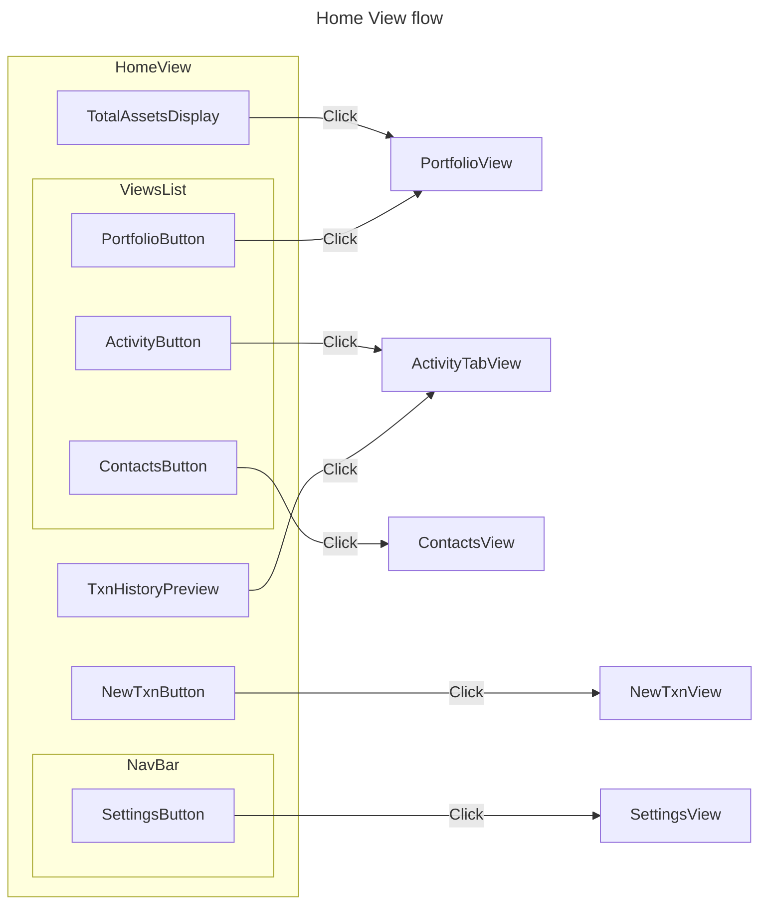

# `Home View` Documentation

## `Home View` flow and components

## Description of `Home View` flow

0. User has completed key initialization from `UserInit` flow
1. "Home" view loads, displaying the components:
   - `Navbar`, containing:
     - Text displaying current view
     - `SettingsButton`
   - `TotalAssetsDisplay`, clickable, links to `PortfolioView`
   - `ViewsList`, containing buttons for views:
     - `PortfolioView`
     - `ActivityView`
     - (In review) `ContactsView`
   - `NewTxnButton` - to create a new transaction
