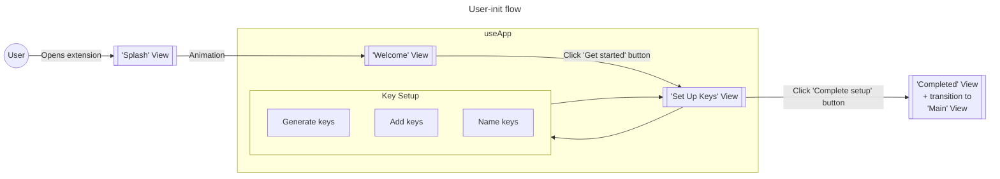
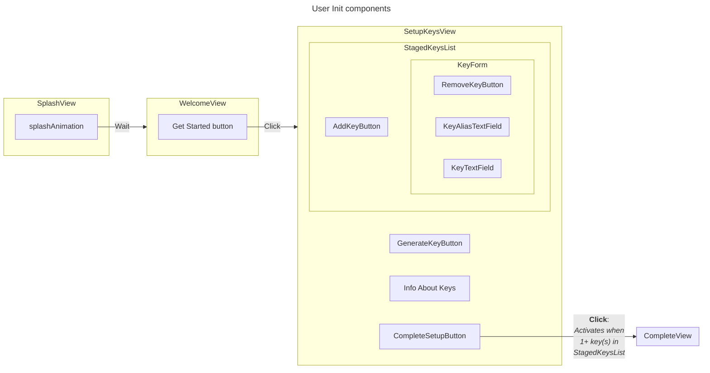
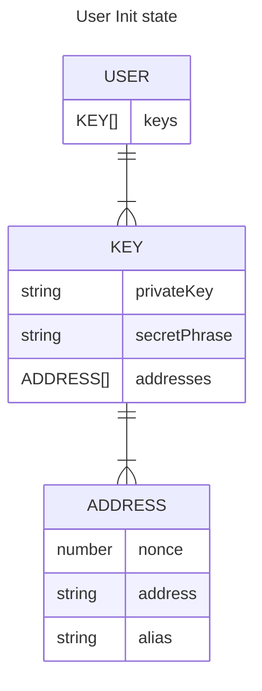

# `User Init` flow

0. User opens extension
1. "Splash" view loads
1. "Welcome" view loads
   - Text welcoming the user
   - [Button] "Get started"
1. "Set Up Keys" view loads
   - [NavLeft-Button] Back arrow
   - [Modal] "What are keys" > "A key holds your accounts..." (high-level copy about what a key is)
   - [Button] "Generate new key"
     - This adds a key to the list of keys below
   - [List] Keys (generated and manually added)
     - [TextField] Enter key (secret phrase/byte-string/upload file containing key/connect to external device)
       - [Drawer] "(Optional) Name for key"
       - [Button] Remove key
   - [BottomNav]
     - [Button] Back
     - [Button] Confirm

# `User Init` components

# `User Init` state

